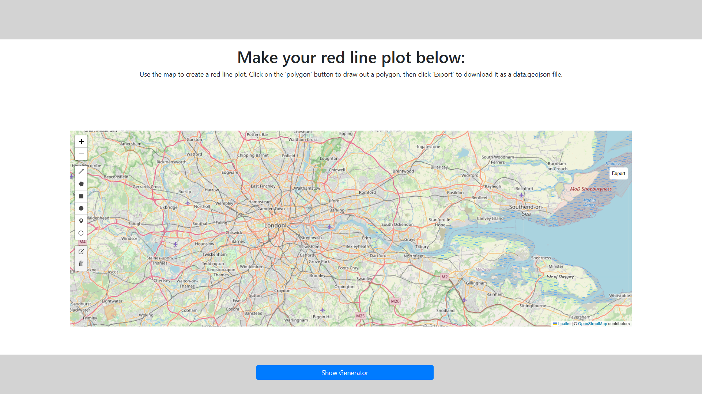
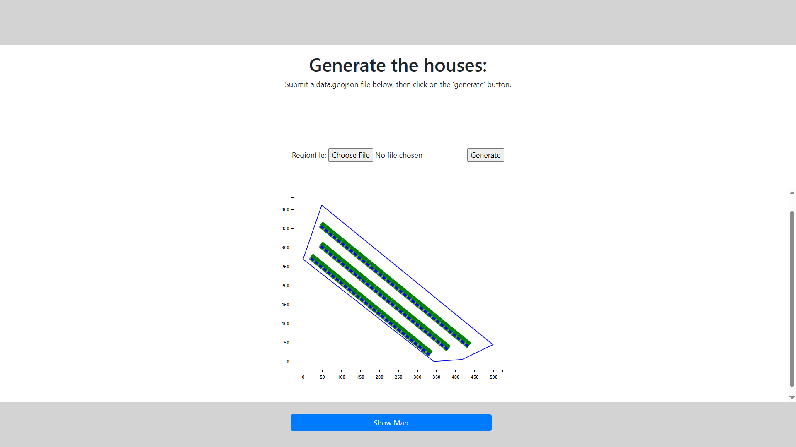
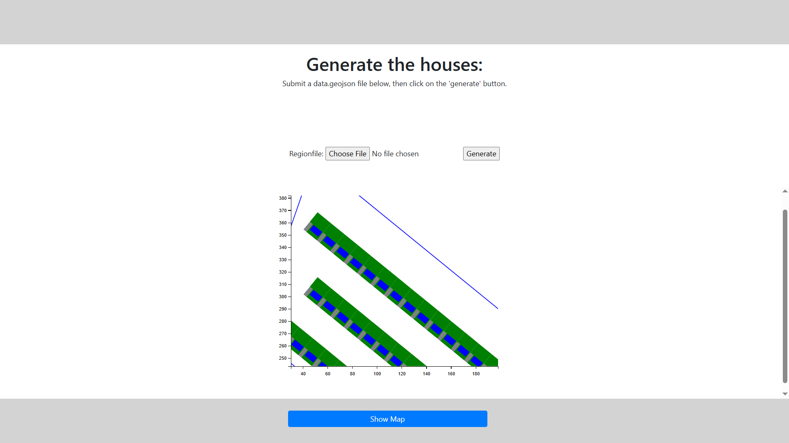

<a id="readme-top"></a>

<h3 align="center">AutoPlot</h3>
  <p align="center">
    Automatically plots houses in a user-provided region of space
  </p>
</div>


<!-- TABLE OF CONTENTS -->
<details>
  <summary>Table of Contents</summary>
  <ol>
    <li>
      <a href="#about-the-project">About The Project</a>
    </li>
    <li>
      <ul>
        <li><a href="#prerequisites">Prerequisites</a></li>
        <li><a href="#installation">Installation</a></li>
      </ul>
    </li>
    <li><a href="#usage">Usage</a></li>
    <li><a href="#roadmap">Roadmap</a></li>
    <li><a href="#contributing">Contributing</a></li>
    <li><a href="#license">License</a></li>
    <li><a href="#contact">Contact</a></li>
    <li><a href="#acknowledgments">Acknowledgments</a></li>
  </ol>
</details>


<!-- ABOUT THE PROJECT -->
## About The Project

Welcome! This software works with .geojson files and has its own method of generating them, but users are welcome to submit their own. It is available in a website, but the website must be run locally as it is not hosted anywhere.

Feel free to browse the python files! For a better understanding of the plotting process (separate to the website), check out the file 'README_software' in the folder 'HOUSE/website/rlpsite/plot/software'.

TO RUN:
The website can be run by cd'ing into 'HOUSE/website/rlpsite' and executing 'python manage.py runserver' into your terminal. The available pages are '/plot' and '/plot/generate'.
If you don't want to use the website, run the file 'HOUSE/website/rlpsite/plot/software/Main.py' after making your desired setup (a default one exists too, but isn't good for large RLPs).

<p align="right">(<a href="#readme-top">back to top</a>)</p>


### Prerequisites

The plotting side of this software heavily uses the 'shapely', 'geopandas', and 'pandas' packages, so a strong understanding is
recommended.

### Installation

1. Clone the repo
   ```
   git clone https://github.com/Saihan786/House
   ```
2. Install pip packages
   ```
   pip install -r requirements.txt
   ```

<p align="right">(<a href="#readme-top">back to top</a>)</p>


<!-- USAGE EXAMPLES -->
## Usage


<br>
<br>

<br>
<br>


<p align="right">(<a href="#readme-top">back to top</a>)</p>


<!-- ROADMAP -->
## Roadmap

- [ ] Road Generator
    - [ ] Chunk Division
- [ ] Flex Blocks
- [ ] Curve Approximation
- [ ] Match to other software

<p align="right">(<a href="#readme-top">back to top</a>)</p>


<!-- LICENSE -->
<!-- ## License

Distributed under the MIT License. See `LICENSE.txt` for more information.

<p align="right">(<a href="#readme-top">back to top</a>)</p> -->


<!-- CONTACT -->
## Contact

Saihan - marshall.s15@hotmail.com - https://www.linkedin.com/in/saihan-marshall/

Project Link: [House](https://github.com/Saihan786/House)

<p align="right">(<a href="#readme-top">back to top</a>)</p>